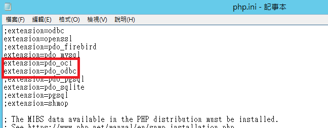

<h1>PHP使用PDO連練ORACLE DB</h1>
<p><h3>環境資訊</h3></p>
<p>OS：Windows Server 2012 R2 x64</p>
<p>Oracle Database：9i</p>
<p>Wampserver：3.2.6</p><p>Server：Apache 2.4</p>
<p>PHP：PHP 8.1</p>

||<p><h3>安裝步驟</h3></p><p><h4>1. 安裝ORACLE INSTANT CLIENT安裝</h4></p><p><h4>2. 設定PHP  CONFIG </h4></p><p><h4>3. 檢查安裝是否成功</h4></p>|
| :-: | :- |


**1.** **安裝ORACLE INSTANT CLIENT安裝**

(1)下載 ORACLE INSTANT CLIENT，這裡下載11版(因ORACLE版本很舊)

<https://www.oracle.com/database/technologies/instant-client/winx64-64-downloads.html>


(2)將檔案解壓縮，放到想放的目錄(這裡放到D:\)

(3)點選本機(我的電腦)右鍵 > 內容 > 進階系統設定 >進階 >環境變數，找到 Path 的欄位按編輯，加入

剛才的存放位置 「D:\...」


**2.** **設定PHP  CONFIG**

修改php.ini


找到以下分別將最前面的分號 「;」 去掉，然後重開Apache



**3.檢查安裝是否成功**

修改以下PHP程式碼換上對應的DB連線資訊，然後測試是否連線成功

```
$ocidb = "oci:dbname=(description=(address=(protocol=tcp)(host=192.168.0.1)(port=1521))(connect_data=(sid=mysid)));charset=utf8";
$username = "username";
$password = "password";

try {

   $oci_conn = new PDO($ocidb, $username, $password);
   if ($oci_conn){
      echo 'success';
}
} catch (PDOException $e) {
   echo $e->getMessage();
}
```

查詢資料的範例
```
$stmt = $GLOBALS["oci_conn"]->query("SELECT * from people");
$rows = $stmt->fetchAll();
foreach ($rows as $row) {

   echo json_encode($row);

}
```

### 參考資料：
* [XAMPP — PHP 連接 ORACLE 環境設定](https://medium.com/@s10614609/xampp-php-%E9%80%A3%E6%8E%A5-oracle-%E7%92%B0%E5%A2%83%E8%A8%AD%E5%AE%9A-4d0b967eb23b)
