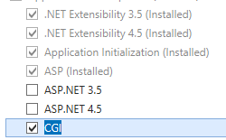
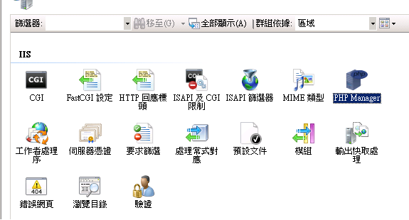
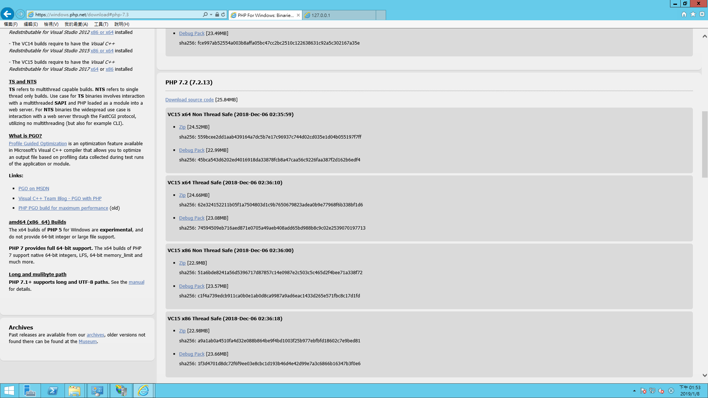
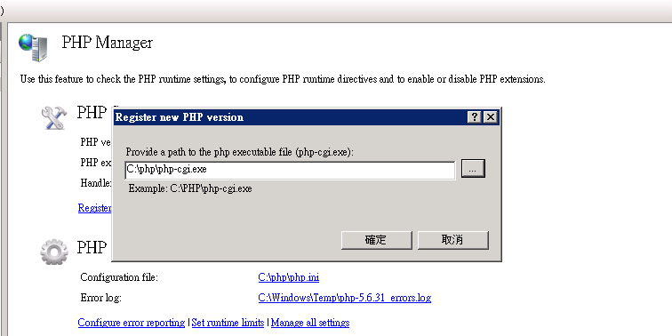
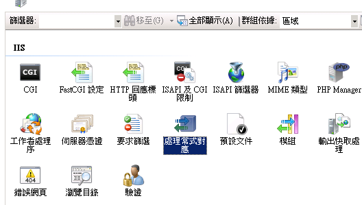

<h1>IIS 執行 PHP</h1>

<h3>環境資訊</h3>

OS：Windows Server 2012(x64)

Server：IIS 8

||
<h3>安裝步驟</h3>

<h4>1. 安裝CGI 功能</h4>

<h4>2. 安裝PHP MANAGER</h4>

<h4>3. 安裝PHP核心</h4>

<h4>4. 使用PHP MANAGER 設定PHP路徑</h4>

<h4>5. 確認安裝是否成功</h4>

<h4></h4>
|
| :-: | :- |

**1.安裝CGI 功能**

請先進入伺服器管理員的角色項目中，確認 CGI 功能是否已安裝，若沒有則參考

<https://docs.microsoft.com/en-us/iis/configuration/system.webserver/cgi>，或參考以下步驟：

Windows Server 2012 or Windows Server 2012 R2

`    `On the taskbar, click Server Manager.

`    `In Server Manager, click the Manage menu, and then click Add Roles and Features.

`    `In the Add Roles and Features wizard, click Next. Select the installation type and click Next. Select the destination server and click Next.

`    `On the Server Roles page, expand Web Server (IIS), expand Web Server, expand Application Development, and then select CGI. Click Next.

`    `On the Select Features page, click Next.

`    `On the Confirm installation selections page, click Install.

`    `On the Results page, click Close.

**2.** **安裝 PHP Manager** 

官方網站:

<https://docs.phpmanager.xyz/>

下載頁面:

<https://github.com/phpmanager/phpmanager/releases>

Note: 如果之前沒有安裝Net framework 4.5.2則需要安裝 (一定要4.5.2或以上版本)

下載連結:

<https://www.microsoft.com/en-us/download/confirmation.aspx?id=42642>

安裝完成後，再次開起 IIS 時，則會在管理首頁的 IIS 項目中看到 PHP Manager 這項工具。

` `

**3.安裝PHP核心**

至 PHP 官網下載 PHP 核心(zip)，並解壓縮至任意系統目錄中。

官網下載頁面:

` `http://php.net/downloads.php

按下“Windows downloads”後會看到以下各種版本，選擇需要的PHP版本(一般都是安裝有Thread Safe的版本)

Note : 如果之前沒有安裝VC就需要安裝，VC版本需對應下載的PHP版本

安裝VC 14 (對應所使用的PHP版本)

<https://www.microsoft.com/zh-tw/download/confirmation.aspx?id=48145>

**4.使用PHP MANAGER 設定PHP路徑**

進入 PHP Manager 點選 Register new PHP Version，並選擇解壓縮後 PHP 目錄的 php-cgi.exe(上一個步驟)。

**5.檢查安裝是否成功**

回到管理首頁的 IIS 項目中進入處理常式對應檢查項目中是否已存在 PHP ，並已啟用。

